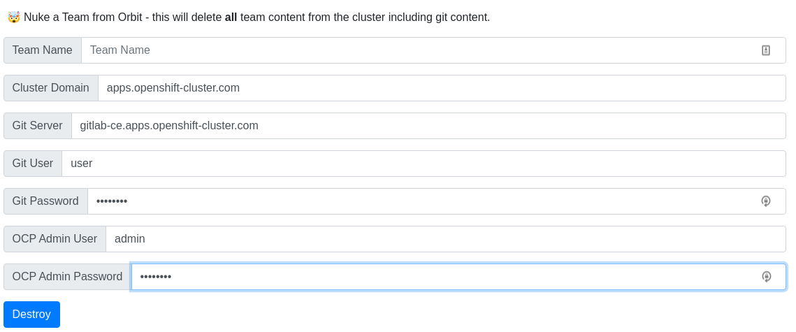

# tl500-teamsters

A Quarkus Qute, k8s-api based application to help "fast forward" TL500 teams. 





## Configuration

```bash
# set the following env vars
export CLUSTER_DOMAIN=         # cluster base domain (no https://)
export GIT_SERVER=             # git server (no https://)
export TEAM_NAME=              # team name [a-bA-B0-9-]
export GITLAB_USER=            # team gitlab username (same as ocp username)
export GITLAB_PASSWORD=        # team gitlab password for user
export OCP_ADMIN_USER=         # ocp cluster-admin user
export OCP_ADMIN_PASSWORD=     # ocp cluster-admin password
```

## Run

```bash
mvn quarkus:dev
```

## OpenShift

```bash
oc new-project tl500-teamsters
source ~/tmp/tech-env-test.sh
oc delete secret teamsters
oc create secret generic teamsters \
  --from-literal=CLUSTER_DOMAIN=${CLUSTER_DOMAIN} \
  --from-literal=GIT_SERVER=${GIT_SERVER} \
  --from-literal=GITLAB_USER=${GITLAB_USER} \
  --from-literal=GITLAB_PASSWORD=${GITLAB_PASSWORD} \
  --from-literal=OCP_ADMIN_USER=${OCP_ADMIN_USER} \
  --from-literal=OCP_ADMIN_PASSWORD=${OCP_ADMIN_PASSWORD} \
  --from-literal=FORCE_HTTPS=true
oc new-app quay.io/eformat/tl500-teamsters --name teamsters
oc set env --from=secret/teamsters deployments/teamsters
oc expose svc teamsters
oc patch route/teamsters --type=json -p '[{"op":"add", "path":"/spec/tls", "value":{"termination":"edge","insecureEdgeTerminationPolicy":"Redirect"}}]'
oc create serviceaccount teamsters
oc patch deployment teamsters --patch '{"spec":{"template":{"spec":{"serviceAccountName": "teamsters"}}}}'
oc adm policy add-cluster-role-to-user edit system:serviceaccount:tl500-teamsters:teamsters -n tl500
```
